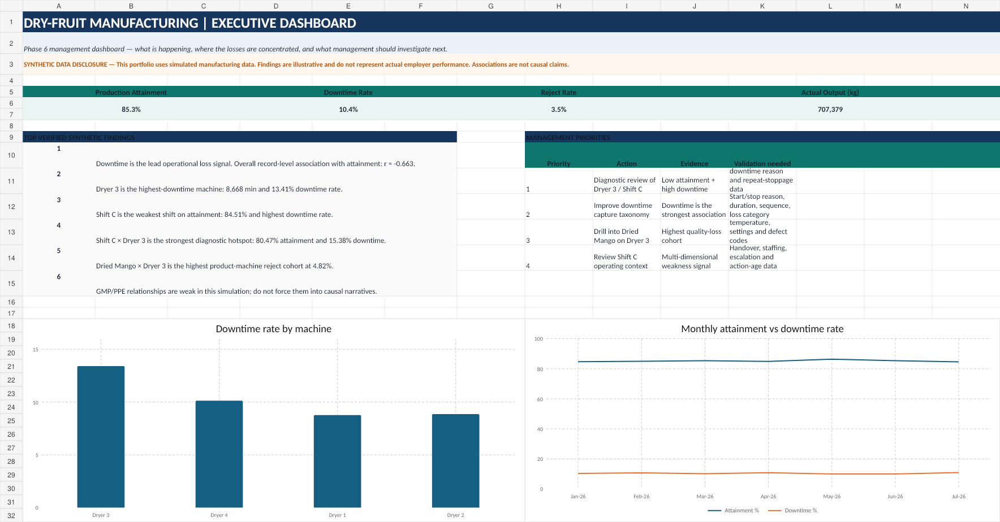
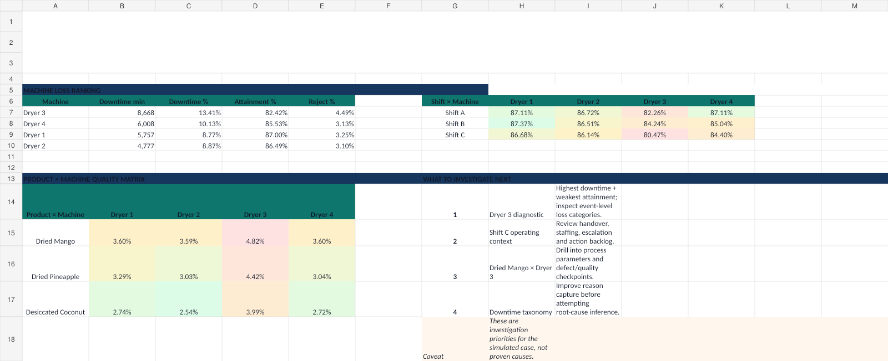
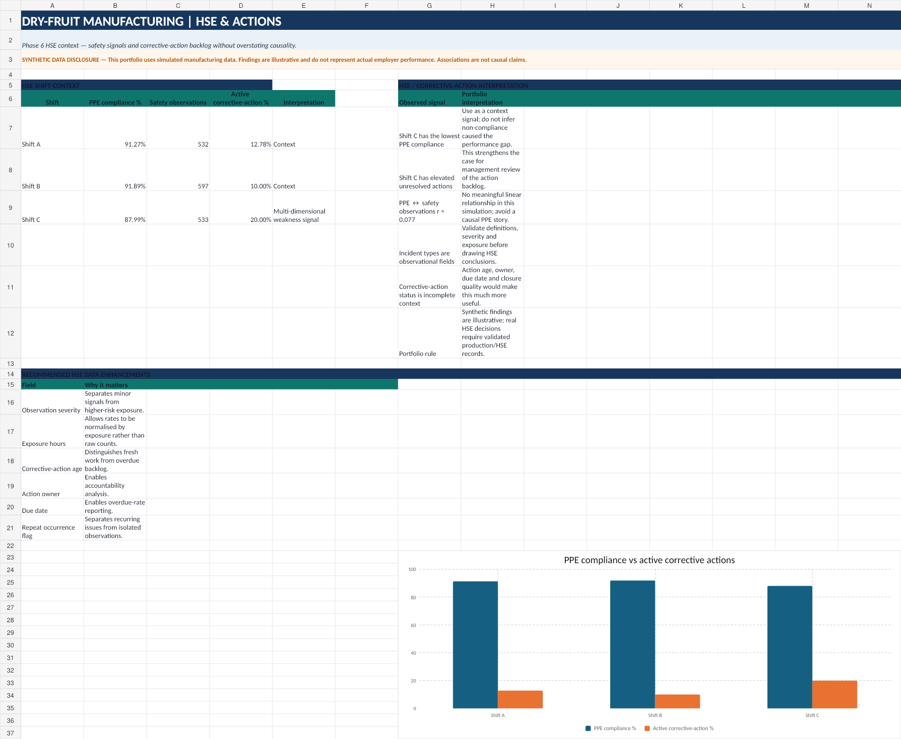

# Dry-Fruit Manufacturing Operations Performance & HSE Analytics

> **Portfolio disclosure:** This is a **simulated manufacturing analytics case study using synthetic data**. The findings are illustrative and do not represent actual employer performance.

[](https://amosadebor.github.io/dry-fruit-manufacturing-analytics/)
[](https://www.linkedin.com/in/amos-adebo)

## Project overview

This project examines production attainment, downtime, quality losses, maintenance and HSE signals in a simulated dry-fruit manufacturing environment.

The project demonstrates an end-to-end analytics workflow:

**Business question → Data quality → KPI design → Excel analysis → SQL reproduction → Deeper analysis → Dashboard → Management investigation priorities**

### Business question

> What operational factors appear to be associated with production underperformance, quality losses and HSE exposure in the simulated environment?

## Dataset

The working dataset contains **540 synthetic production records** covering:

- target and actual production output;
- planned changeover and downtime;
- rejects and rework;
- PPE compliance, housekeeping and GMP;
- safety observations and incident type;
- corrective-action status;
- maintenance type and duration;
- fuel usage;
- product, machine, shift and production date.

## KPI framework

- **Production Attainment** = Actual Output / Target Output × 100
- **Reject Rate** = Rejects / Actual Output × 100
- **Downtime Rate** = Downtime Minutes / Scheduled Minutes × 100
- **Net Good Output** = Actual Output − Rejects

The workbook also contains an **OEE-like** illustrative metric. It is intentionally not presented as formal OEE.

## Selected simulated findings

- Downtime shows the strongest simulated association with production attainment (overall r ≈ **-0.663**).
- Dryer 3 has the highest simulated downtime burden (**8,668 min; 13.41% downtime rate**).
- Shift C has the weakest simulated attainment (**84.51%**) and the highest downtime rate.
- Shift C × Dryer 3 is the strongest diagnostic hotspot (**80.47% attainment; 15.38% downtime rate**).
- Dried Mango × Dryer 3 has the highest simulated product-machine reject rate (**4.82%**).
- GMP/reject and PPE/safety-observation relationships are weak in this simulation and are not treated as causal drivers.

## Management investigation priorities

1. Diagnose the simulated **Dryer 3 / Shift C** combination using event-level downtime and operating-context data.
2. Improve downtime taxonomy and event capture so future root-cause analysis is more defensible.
3. Drill into the **Dried Mango × Dryer 3** quality interaction using process-condition and defect information.
4. Review Shift C handover, workload, escalation and corrective-action context.
5. Improve HSE analytical granularity through severity, exposure, action-age and repeat-occurrence fields.

## Visuals

### Executive dashboard



### Operations dashboard



### HSE dashboard



## Repository structure

This repository is intentionally kept **flat** to make public deployment easy from a phone.

```text
dry-fruit-manufacturing-analytics/
├── README.md
├── index.html
├── style.css
├── .nojekyll
├── data_dictionary.md
├── analysis_notes.md
├── phase4_analysis.sql
├── phase5_deeper_analysis.sql
├── Simulated_Dry_Fruit_Analytics_Portfolio_Pack.xlsx
├── dashboard_executive.png
├── dashboard_operations.png
├── dashboard_hse.png
├── case-study.md
├── limitations.md
├── quality_notes.md
├── synthetic_data_disclosure.md
├── project_completion_readout.md
├── LICENSE
└── .gitignore
```

## Technical evidence

**SQL:** [`phase4_analysis.sql`](phase4_analysis.sql) and [`phase5_deeper_analysis.sql`](phase5_deeper_analysis.sql)  
**Analytical notes:** [`analysis_notes.md`](analysis_notes.md)  
**Dashboard workbook:** [`Simulated_Dry_Fruit_Analytics_Portfolio_Pack.xlsx`](Simulated_Dry_Fruit_Analytics_Portfolio_Pack.xlsx)  
**Full case study:** [`case-study.md`](case-study.md)  
**Limitations:** [`limitations.md`](limitations.md)

## What this project demonstrates

- Translating an operational problem into analytical questions.
- Data-quality checking and KPI construction.
- Excel-based operational analysis.
- SQL reproduction of analytical questions.
- Subgroup and interaction analysis.
- Relationship testing without overstating causality.
- Management-oriented dashboarding.
- Business-oriented communication and investigation prioritisation.
- Explicit documentation of synthetic data and analytical limitations.

## Next technical extension

A future iteration can reproduce the workflow in **Python/pandas** with automated data-quality checks, KPI calculations, statistical testing and exported dashboard-ready tables.

## About the author

**Amos Adebo** is a manufacturing and operations professional building practical data analytics capability around production, HSE and operational-performance problems.

- LinkedIn: https://www.linkedin.com/in/amos-adebo
- GitHub: https://github.com/amosadebor
